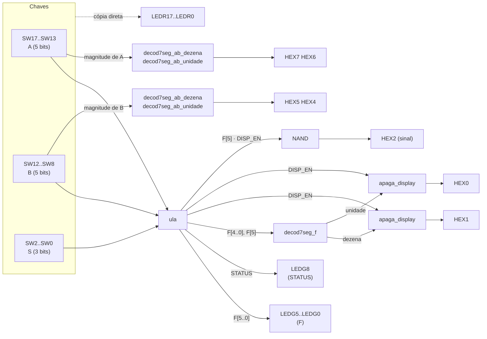

# Projeto 1 — ULA de 5 bits com displays de 7 segmentos (DE2-115)

Unidade Lógica e Aritmética (ULA) com operandos em **sinal-magnitude**, oito operações (soma, subtração, complemento a 2, três comparações, AND e XOR) e decodificadores para os displays de 7 segmentos da placa **Terasic DE2-115** (FPGA **Cyclone IV E EP4CE115F29C7**).

Projeto da primeira unidade de **Sistemas Digitais** (CIn/UFPE, 2026.2), feito **somente com portas lógicas** em esquemáticos (`.bdf`) no **Quartus Prime Lite**.

> **Situação:** versão final. Todos os blocos foram compilados no Quartus e simulados com todas as combinações de entrada, e o sistema completo foi **testado na placa e funciona**.

---

## Sumário

1. [Visão geral](#1-visão-geral)
2. [Como usar na placa](#2-como-usar-na-placa)
3. [Exemplos para testar](#3-exemplos-para-testar)
4. [A lógica por trás](#4-a-lógica-por-trás)
5. [Módulos](#5-módulos)
6. [Toplevel e pinagem](#6-toplevel-e-pinagem)
7. [Como compilar, gravar e simular](#7-como-compilar-gravar-e-simular)
8. [Verificação](#8-verificação)
9. [Requisitos do enunciado](#9-requisitos-do-enunciado)
10. [Estrutura do repositório](#10-estrutura-do-repositório)
11. [Decisões de projeto](#11-decisões-de-projeto)

---

## 1. Visão geral

A ULA recebe dois números de 5 bits, **A** e **B**, e um seletor de 3 bits, **S**. Conforme S, ela calcula uma operação e mostra o resultado em LEDs e displays.

| S₂ S₁ S₀ | Operação | Resultado aparece em |
| :---: | :--- | :--- |
| `000` | F = A + B | LEDs verdes (F) e displays HEX2-HEX1-HEX0 |
| `001` | F = A − B | LEDs verdes (F) e displays HEX2-HEX1-HEX0 |
| `010` | F = complemento a 2 de B | LEDs verdes (F) |
| `011` | A = B ? | LED de STATUS |
| `100` | A > B ? | LED de STATUS |
| `101` | A < B ? | LED de STATUS |
| `110` | F = A AND B (bit a bit) | LEDs verdes (F) |
| `111` | F = A XOR B (bit a bit) | LEDs verdes (F) |

**Entradas**

* **A** e **B**: 5 bits em sinal-magnitude, `[S, M3, M2, M1, M0]`. O bit de sinal é 1 para negativo e 0 para positivo; a magnitude vai de 0 a 15. Quem usa a placa não precisa saber complemento a 2: toda conversão é feita dentro da ULA.
* **S**: 3 bits, seleciona a operação.

**Saídas**

* **F**: 6 bits em sinal-magnitude, `[S_F, F4, F3, F2, F1, F0]` (o resultado de soma e subtração vai de −30 a +30).
* **STATUS**: 1 bit, verdadeiro/falso das comparações.
* **Displays**: \|A\|, \|B\| e \|F\| em dezena e unidade; o sinal de F no HEX2.

### Diagrama de blocos do sistema



---

## 2. Como usar na placa

### 2.1 Gravar o projeto

1. Abra `src/Projeto1SD.qpf` no Quartus e compile (**Ctrl+L**). A pinagem já está no `src/Projeto1SD.qsf`.
2. Ligue a DE2-115 na fonte, aperte o botão de energia e ligue o cabo USB no conector **USB BLASTER**. Deixe a chave **SW19 (RUN/PROG)** em **RUN**.
3. *Tools > Programmer* → *Hardware Setup*: **USB-Blaster**, modo **JTAG** → arquivo `src/output_files/Projeto1SD.sof`, com *Program/Configure* marcado → **Start**.

A gravação por JTAG se perde ao desligar a placa; para usar de novo, grave outra vez.

### 2.2 Entradas: as chaves

Chave **para cima = 1**, para baixo = 0.

| Chaves | Sinal | Significado |
| :--- | :--- | :--- |
| **SW17** | A[4] | **sinal de A** (1 = negativo) |
| SW16 SW15 SW14 SW13 | A[3..0] | magnitude de A (SW16 é o bit mais alto) |
| **SW12** | B[4] | **sinal de B** (1 = negativo) |
| SW11 SW10 SW9 SW8 | B[3..0] | magnitude de B (SW11 é o bit mais alto) |
| SW7 a SW3 | — | não usadas |
| **SW2 SW1 SW0** | S[2..0] | **operação** (SW2 é o bit mais alto) |

Exemplo: A = −5 é `SW17..SW13 = 1 0101`; B = +3 é `SW12..SW8 = 0 0011`; subtração é `SW2..SW0 = 001`.

### 2.3 Saídas: LEDs e displays

```text
 HEX7  HEX6   HEX5  HEX4   HEX3   HEX2   HEX1  HEX0
 [ 1 ] [ 5 ]  [ 0 ] [ 3 ]  [   ]  [ - ]  [ 1 ] [ 2 ]
  dezena/uni   dezena/uni  (vago) sinal   dezena/uni
  de |A|       de |B|              de F   de |F|
```

| Saída | O que mostra | Quando |
| :--- | :--- | :--- |
| **HEX7 / HEX6** | \|A\| (dezena / unidade, 00 a 15) | sempre |
| **HEX5 / HEX4** | \|B\| (dezena / unidade, 00 a 15) | sempre |
| **HEX2** | `−` (segmento g) quando F é negativo | só em `000` e `001` |
| **HEX1 / HEX0** | \|F\| (dezena / unidade, 00 a 30) | só em `000` e `001`; apagados nas outras operações |
| HEX3 | — | sempre apagado |
| **LEDR17 … LEDR0** | cópia das chaves SW17 … SW0 | sempre |
| **LEDR17** | **sinal de A** (aceso = negativo) | sempre |
| **LEDR12** | **sinal de B** (aceso = negativo) | sempre |
| **LEDG5** | F[5] = **sinal de F** (aceso = negativo) | sempre |
| **LEDG4 … LEDG0** | F[4] … F[0] (LEDG0 é o bit mais baixo) | sempre |
| **LEDG8** | **STATUS**: aceso = comparação verdadeira | só em `011`, `100`, `101` |
| LEDG7, LEDG6 | — | sempre apagados |

### 2.4 Como ler cada operação

* **Soma e subtração (`000`, `001`):** leia o número nos displays: HEX2 mostra `−` se for negativo, HEX1/HEX0 mostram a magnitude. Os LEDs verdes mostram o mesmo resultado em binário (sinal-magnitude).
* **Complemento a 2 de B (`010`):** leia os LEDs verdes. Se B é positivo, F é o próprio B; se B é negativo, F é o complemento a 2 de B em 5 bits, com o sinal repetido no bit 5. Os displays de F ficam apagados.
* **Comparações (`011`, `100`, `101`):** leia o **LEDG8**. Os LEDs de F ficam todos apagados (`000000`). Os displays de F ficam apagados.
* **AND e XOR (`110`, `111`):** leia os LEDs verdes. LEDG5 = sinal de A AND/XOR sinal de B; LEDG4 fica sempre apagado; LEDG3..LEDG0 = magnitudes bit a bit. Os displays de F ficam apagados.

**Zero negativo:** `10000` (−0) é tratado como zero. Nas comparações, +0 = −0; nas contas, o resultado zero sempre sai `+0`.

---

## 3. Exemplos para testar

A: `SW17..SW13` · B: `SW12..SW8` · S: `SW2..SW0`

| S | A | B | Conta | HEX2 HEX1 HEX0 | LEDG5..LEDG0 | LEDG8 |
| :---: | :---: | :---: | :--- | :---: | :---: | :---: |
| `000` | `00101` (+5) | `10011` (−3) | 5 + (−3) = +2 | ` ` `0` `2` | `000010` | apagado |
| `001` | `00010` (+2) | `00101` (+5) | 2 − 5 = −3 | `−` `0` `3` | `100011` | apagado |
| `001` | `11001` (−9) | `01100` (+12) | −9 − 12 = −21 | `−` `2` `1` | `110101` | apagado |
| `000` | `11000` (−8) | `11000` (−8) | −8 + (−8) = −16 | `−` `1` `6` | `110000` | apagado |
| `000` | `11111` (−15) | `11111` (−15) | −15 + (−15) = −30 | `−` `3` `0` | `111110` | apagado |
| `000` | `01111` (+15) | `01111` (+15) | 15 + 15 = +30 | ` ` `3` `0` | `011110` | apagado |
| `001` | `00111` (+7) | `00111` (+7) | 7 − 7 = 0 | ` ` `0` `0` | `000000` | apagado |
| `000` | `10000` (−0) | `00000` (+0) | −0 + 0 = 0 | ` ` `0` `0` | `000000` | apagado |
| `010` | qualquer | `10011` (−3) | C2(−3) = `11101` | apagados | `111101` | apagado |
| `010` | qualquer | `00101` (+5) | C2(+5) = `00101` | apagados | `000101` | apagado |
| `011` | `10000` (−0) | `00000` (+0) | −0 = +0 ? sim | apagados | `000000` | **aceso** |
| `011` | `00011` (+3) | `10011` (−3) | +3 = −3 ? não | apagados | `000000` | apagado |
| `100` | `00010` (+2) | `10101` (−5) | +2 > −5 ? sim | apagados | `000000` | **aceso** |
| `100` | `10010` (−2) | `10101` (−5) | −2 > −5 ? sim | apagados | `000000` | **aceso** |
| `101` | `10011` (−3) | `10011` (−3) | −3 < −3 ? não | apagados | `000000` | apagado |
| `101` | `10111` (−7) | `00001` (+1) | −7 < +1 ? sim | apagados | `000000` | **aceso** |
| `110` | `00101` (+5) | `00011` (+3) | 0101 AND 0011 | apagados | `000001` | apagado |
| `110` | `10101` (−5) | `10011` (−3) | sinais 1 AND 1 | apagados | `100001` | apagado |
| `111` | `00101` (+5) | `00011` (+3) | 0101 XOR 0011 | apagados | `000110` | apagado |

---

## 4. A lógica por trás

### 4.1 Sinal-magnitude e complemento a 2

Em **sinal-magnitude (SM)**, o bit mais alto é o sinal e os outros são o valor absoluto: `10101` = −5. É fácil de ler, mas difícil de somar: somar −5 com +3 exige comparar magnitudes e subtrair a menor da maior.

Em **complemento a 2 (C2)**, um único somador binário faz soma e subtração de números com e sem sinal. O C2 de um número é obtido invertendo todos os bits e somando 1. Um atalho equivalente, usado nos blocos `inversor` e `inversor5`: **copiar os bits da direita até o primeiro 1 (inclusive) e inverter todos os outros**. Por isso cada bit de saída é `bit XOR (algum bit abaixo dele é 1)`.

Por isso a ULA trabalha assim nas contas: **SM → C2 → soma → C2 → SM**. Entrada e saída ficam em SM, como pede o enunciado, e a conta é feita em C2.

### 4.2 Soma e subtração

1. **Subtração vira soma:** A − B = A + (−B). Trocar o sinal de B em SM é só inverter o bit de sinal: `sinal_B' = sinal_B XOR S[0]`. Na soma (`S[0] = 0`) o sinal fica; na subtração (`S[0] = 1`) inverte.
2. **SM → C2 (`comp2`):** se o número é positivo, a magnitude passa direto; se é negativo, sai o C2 da magnitude. O resultado é um número em C2 de 5 bits (−15 a +15). O −0 (`10000`) sai como `00000`, senão viraria −16 em C2.
3. **Soma em 6 bits (`somador6`):** a soma de dois números de −15 a +15 vai de −30 a +30, que não cabe em 5 bits. Por isso os operandos são **estendidos para 6 bits repetindo o bit de sinal** e somados por 6 somadores completos em cascata. Em 6 bits não há overflow possível.
4. **C2 → SM (`c2_para_sm`):** se o resultado é positivo (bit 5 = 0), já está em SM. Se é negativo, a magnitude é o C2 dos 5 bits de baixo; o sinal continua no bit 5.

Exemplo, (−9) − (+12):

| Passo | A | B | Comentário |
| :--- | :---: | :---: | :--- |
| Entrada (SM) | `11001` | `01100` | −9 e +12 |
| Inverte sinal de B | `11001` | `11100` | −9 e −12 |
| `comp2` (C2, 5 bits) | `10111` | `10100` | −9 e −12 em C2 |
| Estende para 6 bits | `110111` | `110100` | repete o bit de sinal |
| `somador6` | `101011` | | −21 em C2 |
| `c2_para_sm` | `110101` | | sinal 1, magnitude `10101` = 21 → **−21** |

### 4.3 Complemento a 2 de B (operação `010`)

É o próprio bloco `comp2` aplicado a B: B positivo sai igual; B negativo sai em C2. A saída de 5 bits `{OS, O3..O0}` é estendida para 6 bits repetindo o sinal: **F = {OS, OS, O3, O2, O1, O0}**. Exemplo: B = −3 (`10011`) → C2 = `11101` → F = `111101`.

### 4.4 Comparações em sinal-magnitude

Comparar em SM é comparar sinais primeiro e magnitudes depois:

| Sinal de A | Sinal de B | A > B quando… |
| :---: | :---: | :--- |
| + | + | \|A\| > \|B\| |
| − | − | \|A\| < \|B\| (o de menor magnitude é o maior) |
| + | − | sempre, **exceto** se os dois forem zero (+0 = −0) |
| − | + | nunca |

O bloco `comp_mag` compara magnitudes de 4 bits; o `comp_maior` aplica a tabela acima. Como **A < B é o mesmo que B > A**, a ULA usa uma segunda instância do `comp_maior` com A e B trocados, sem precisar de um "comparador menor". A igualdade (`comparador_igual`) exige magnitudes iguais e, se a magnitude não for zero, sinais iguais.

### 4.5 Operações lógicas

AND e XOR são feitos **bit a bit** sobre os 5 bits de entrada (o sinal também entra na operação: `F[5] = SA op SB`). O bit F[4] fica em 0, porque a magnitude de entrada tem só 4 bits.

### 4.6 Seleção da saída

Quatro resultados disputam o vetor F: soma/subtração, C2 de B, AND e XOR. Um **decodificador** transforma S em 2 bits de seleção, e um **MUX 4:1 de 6 bits** escolhe o resultado. Nas comparações, um sinal **F_EN** zera F (seis portas AND), e outro par decodificador + MUX escolhe qual comparação vai para o STATUS.

### 4.7 Displays de 7 segmentos

Os displays da DE2-115 são de **anodo comum**: cada segmento **acende com 0**. Os segmentos são indexados de 0 a 6 na ordem a, b, c, d, e, f, g:

```text
   --a--
  |     |
  f     b
  |     |
   --g--
  |     |
  e     c
  |     |
   --d--
```

| Dígito | a b c d e f g (0 = aceso) |
| :---: | :---: |
| 0 | `0000001` |
| 1 | `1001111` |
| 2 | `0010010` |
| 3 | `0000110` |
| 4 | `1001100` |
| 5 | `0100100` |
| 6 | `0100000` |
| 7 | `0001111` |
| 8 | `0000000` |
| 9 | `0000100` |
| apagado | `1111111` |

Em vez de converter o número para BCD e usar um decodificador BCD → 7 segmentos, o projeto usa **decodificadores diretos do binário para cada dígito**: um bloco gera os segmentos da dezena e outro os da unidade, cada um a partir dos 4 ou 5 bits da magnitude (cada segmento é uma soma de produtos tirada da tabela verdade). A dezena mostra `0` abaixo de 10.

Os displays de F só podem acender na soma e na subtração. Isso é feito pelo `apaga_display`: cada segmento passa por uma porta OR com `NOT DISP_EN`, então, com `DISP_EN = 0`, todos os segmentos vão para 1 (apagados).

---

## 5. Módulos

Todos os blocos ficam numa única pasta, `lib/` (circuito `.bdf` + símbolo `.bsf`). Cada um tem um projeto de teste em `testes/<bloco>/`.

### 5.1 Hierarquia

```text
toplevel (src/toplevel.bdf)
├── ula
│   ├── somador_subtrator ───────── 000 / 001
│   │   ├── comp2 ×2 ── inversor, mux2x1 ×4
│   │   ├── XOR (inverte o sinal de B na subtração)
│   │   ├── somador6 ── somador_completo ×6
│   │   └── c2_para_sm ── inversor5, mux2x1 ×5
│   ├── comp2 ───────────────────── 010
│   ├── op_and, op_xor ──────────── 110 / 111
│   ├── decodificador_saida + mux_saida (mux4x1 ×6) ── escolhe F
│   ├── portas de F_EN e DISP_EN
│   ├── comparador_igual ────────── 011
│   ├── comp_maior ×2 (comp_mag ×2 cada) ── 100 / 101
│   └── decodificador_comparadores + mux_comparadores ── STATUS
├── decod7seg_ab_dezena ×2, decod7seg_ab_unidade ×2 ── |A| e |B|
├── decod7seg_f (decod7seg_f_dezena + decod7seg_f_unidade) ── |F|
├── apaga_display ×2 ── apaga |F| fora de 000/001
└── NAND ── "−" do sinal de F no HEX2
```

### 5.2 Blocos comuns

**`mux2x1`** — MUX 2:1 de 1 bit. Entradas `A`, `B`, `S`; saída `Y`.
`Y = A·S' + B·S` (S = 0 escolhe A, S = 1 escolhe B).

**`mux4x1`** — MUX 4:1 de 1 bit. Entradas `I[3..0]`, `S[1..0]`; saída `yi`.
`yi = I0·S1'·S0' + I1·S1'·S0 + I2·S1·S0' + I3·S1·S0`.

### 5.3 Complemento a 2

**`inversor`** — C2 de 4 bits. `I0..I3` → `F0..F3`.
`F0 = I0` · `F1 = I1 ⊕ I0` · `F2 = I2 ⊕ (I1 + I0)` · `F3 = I3 ⊕ (I2 + I1 + I0)`.

**`inversor5`** — C2 de 5 bits (a magnitude do resultado chega a 30). `I[4..0]` → `O[4..0]`.
`O[k] = I[k] ⊕ (I[k−1] + … + I[0])`, com `O[0] = I[0]`.

**`comp2`** — sinal-magnitude → C2 de 5 bits. Entradas `I[3..0]` (magnitude), `IS` (sinal); saídas `O[3..0]`, `OS`.
* `O = IS ? inversor(I) : I` (quatro `mux2x1` com seletor `IS`).
* `OS = IS · (I3 + I2 + I1 + I0)`: o sinal só fica 1 se a magnitude não for zero, então −0 vira +0.

### 5.4 Aritmética

**`somador_completo`** — soma 3 bits. `A`, `B`, `Cin` → `S`, `Cout`.
`S = A ⊕ B ⊕ Cin` · `Cout = A·B + (A ⊕ B)·Cin`.

**`somador6`** — soma em C2. `A[4..0]`, `B[4..0]` → `O[5..0]`.
Seis `somador_completo` em cascata (*ripple carry*), carry inicial 0. O sexto somador recebe `A[4]` e `B[4]` de novo (extensão de sinal), então O é a soma exata em 6 bits.

**`c2_para_sm`** — C2 de 6 bits → sinal-magnitude. `I[5..0]` → `O[5..0]`.
`O[5] = I[5]` · `O[4..0] = I[5] ? inversor5(I[4..0]) : I[4..0]` (cinco `mux2x1` com seletor `I[5]`).

**`somador_subtrator`** — A ± B em sinal-magnitude. Entradas `sinal_a`, `W[3..0]` (A), `sinal_b`, `X[3..0]` (B), `sinal_op` (0 = soma, 1 = subtração); saída `R[5..0]` (`R[5]` = sinal).
`comp2(A)` e `comp2(B com sinal_b ⊕ sinal_op)` → `somador6` → `c2_para_sm` (ver [4.2](#42-soma-e-subtração)).

### 5.5 Lógica

**`op_and`** / **`op_xor`** — `A[3..0]`, `SA`, `B[3..0]`, `SB` → `F[5..0]`.
`F[3..0] = A op B` bit a bit · `F[4] = 0` · `F[5] = SA op SB`.

### 5.6 Comparadores

**`comp_mag`** — \|A\| > \|B\| em 4 bits. `A[3..0]`, `B[3..0]` → `O`.
Compara do bit mais alto para o mais baixo; `⊙` é XNOR (bits iguais):
`O = A3·B3' + (A3⊙B3)·A2·B2' + (A3⊙B3)(A2⊙B2)·A1·B1' + (A3⊙B3)(A2⊙B2)(A1⊙B1)·A0·B0'`.

**`comp_maior`** — A > B em sinal-magnitude, com +0 = −0. `A[3..0]`, `SA`, `B[3..0]`, `SB` → `O`.
Com `GT = comp_mag(A, B)`, `LT = comp_mag(B, A)` e `NZB = B3 + B2 + B1 + B0` (B ≠ 0):
`O = SA'·(GT + SB·NZB) + SA·SB·LT`.
Essa é a tabela de [4.4](#44-comparações-em-sinal-magnitude): A positivo ganha se \|A\| > \|B\| ou se B é negativo e não nulo; A negativo só ganha se B também é negativo e \|A\| < \|B\|.

**`comparador_igual`** — A = B em sinal-magnitude, com +0 = −0. `A[4..0]`, `B[4..0]` → `F`.
`F = NOT[ (A3⊕B3) + (A2⊕B2) + (A1⊕B1) + (A0⊕B0) + (B≠0)·(A4⊕B4) ]`: magnitudes iguais e, se não forem zero, sinais iguais.

**`decodificador_comparadores`** — `S3 S2 S1` (= `S[2] S[1] S[0]`) → `F1`, `F2`.
`F1 = S3·S2'` · `F2 = S1·(S2 ⊕ S3)`.

**`mux_comparadores`** — `compIgual`, `compMaior`, `compMenor`, `F2`, `F1` → `STATUS`.
`STATUS = compIgual·F2·F1' + compMaior·F2'·F1 + compMenor·F2·F1`.

| S | F2 F1 | STATUS |
| :---: | :---: | :--- |
| `011` | 1 0 | A = B |
| `100` | 0 1 | A > B |
| `101` | 1 1 | A < B |
| outros | 0 0 | 0 |

### 5.7 Seleção da saída

**`decodificador_saida`** — `S3 S2 S1` (= `S[2] S[1] S[0]`) → `F1`, `F2` (seletor do `mux_saida`: `F1` → `S[1]`, `F2` → `S[0]`).
`F1 = S3` · `F2 = S2·(S3' + S1)`.

| S | F1 F2 | `mux_saida` escolhe |
| :---: | :---: | :--- |
| `000`, `001` | 0 0 | soma/subtração |
| `010` | 0 1 | C2 de B |
| `110` | 1 0 | AND |
| `111` | 1 1 | XOR |

Nas comparações (`011`, `100`, `101`) a escolha não importa, porque F é zerado por `F_EN`.

**`mux_saida`** — MUX 4:1 de 6 bits. `SOMA_OU_SUB[5..0]`, `Comp2B[5..0]`, `OP_AND[5..0]`, `OP_XOR[5..0]`, `S[1..0]` → `F[5..0]`. Seis `mux4x1`, um por bit.

### 5.8 ULA

**`ula`** — `A[4..0]`, `B[4..0]`, `S[2..0]` → `F[5..0]`, `STATUS`, `DISP_EN`. Liga todos os blocos acima e acrescenta:

* `F_EN = (S2 ⊙ S1) + S2'·S0'` e `F[k] = FM[k] · F_EN` (FM = saída do `mux_saida`): F vale 0 nas comparações.
* `DISP_EN = S2'·S1'`: 1 só em `000` e `001`.

| S | F_EN | DISP_EN |
| :---: | :---: | :---: |
| `000` | 1 | 1 |
| `001` | 1 | 1 |
| `010` | 1 | 0 |
| `011` | 0 | 0 |
| `100` | 0 | 0 |
| `101` | 0 | 0 |
| `110` | 1 | 0 |
| `111` | 1 | 0 |

### 5.9 Displays

**`decod7seg_ab_dezena`** — dezena de uma magnitude de 0 a 15. Entradas `A, B, C, D` (`A` = bit mais alto, peso 8); saídas `seg_a … seg_g`. Mostra `1` quando o valor é ≥ 10 (`A·(B + C)`) e `0` nos outros casos.

**`decod7seg_ab_unidade`** — unidade de uma magnitude de 0 a 15 (valor mod 10). Entradas `A, B, C, D` (`A` = bit mais alto); saídas `au_seg … gu_seg`.

**`decod7seg_f_dezena`** / **`decod7seg_f_unidade`** — dezena (0 a 3) e unidade de uma magnitude de 0 a 30. Entradas `R4 … R0` (`R4` = bit mais alto); saídas `aDEZ … gDEZ` / `aUNI … gUNI`.

**`decod7seg_f`** — junta os dois anteriores: `S[4..0]` (magnitude de F), `sinal_S` → segmentos da dezena e da unidade, e `led_negativo` (cópia do sinal).

**`apaga_display`** — `I[6..0]`, `EN` → `O[6..0]`, com `I[0]` = segmento a.
`O[k] = I[k] + EN'`: com `EN = 0`, todos os segmentos ficam em 1 (apagados).

---

## 6. Toplevel e pinagem

O toplevel (`src/toplevel.bdf`) liga a `ula`, os decodificadores e os LEDs aos pinos da placa:

| De | Para |
| :--- | :--- |
| `SW[17..13]`, `SW[12..8]`, `SW[2..0]` | `ula.A`, `ula.B`, `ula.S` |
| `SW[17..0]` | `LEDR[17..0]` |
| `ula.F[5..0]` | `LEDG[5..0]` |
| `ula.STATUS` | `LED_STATUS` (LEDG8) |
| `SW[16..13]` (\|A\|) | `decod7seg_ab_dezena` → `HEX7`, `decod7seg_ab_unidade` → `HEX6` |
| `SW[11..8]` (\|B\|) | `decod7seg_ab_dezena` → `HEX5`, `decod7seg_ab_unidade` → `HEX4` |
| `ula.F[4..0]`, `ula.F[5]` | `decod7seg_f` → `apaga_display` (`EN = DISP_EN`) → `HEX1` (dezena) e `HEX0` (unidade) |
| `NAND(F[5], DISP_EN)` | `HEX2[6]` (segmento g, o "−"); `HEX2[5..0]` em VCC (apagados) |

### Pinagem completa (Cyclone IV E EP4CE115F29C7)

A pinagem está em `src/Projeto1SD.qsf` (e também em `src/pinagem_de2_115.tcl`, para reaplicar com `source pinagem_de2_115.tcl` no Tcl Console).

**Chaves**

| Sinal | Pino | Função | Sinal | Pino | Função |
| :--- | :--- | :--- | :--- | :--- | :--- |
| SW[0] | PIN_AB28 | S[0] | SW[9] | PIN_AB25 | B[1] |
| SW[1] | PIN_AC28 | S[1] | SW[10] | PIN_AC24 | B[2] |
| SW[2] | PIN_AC27 | S[2] | SW[11] | PIN_AB24 | B[3] |
| SW[3] | PIN_AD27 | — | SW[12] | PIN_AB23 | sinal de B |
| SW[4] | PIN_AB27 | — | SW[13] | PIN_AA24 | A[0] |
| SW[5] | PIN_AC26 | — | SW[14] | PIN_AA23 | A[1] |
| SW[6] | PIN_AD26 | — | SW[15] | PIN_AA22 | A[2] |
| SW[7] | PIN_AB26 | — | SW[16] | PIN_Y24 | A[3] |
| SW[8] | PIN_AC25 | B[0] | SW[17] | PIN_Y23 | sinal de A |

**LEDs**

| Sinal | Pino | Sinal | Pino | Sinal | Pino |
| :--- | :--- | :--- | :--- | :--- | :--- |
| LEDR[0] | PIN_G19 | LEDR[9] | PIN_G17 | LEDG[0] (F0) | PIN_E21 |
| LEDR[1] | PIN_F19 | LEDR[10] | PIN_J15 | LEDG[1] (F1) | PIN_E22 |
| LEDR[2] | PIN_E19 | LEDR[11] | PIN_H16 | LEDG[2] (F2) | PIN_E25 |
| LEDR[3] | PIN_F21 | LEDR[12] | PIN_J16 | LEDG[3] (F3) | PIN_E24 |
| LEDR[4] | PIN_F18 | LEDR[13] | PIN_H17 | LEDG[4] (F4) | PIN_H21 |
| LEDR[5] | PIN_E18 | LEDR[14] | PIN_F15 | LEDG[5] (sinal de F) | PIN_G20 |
| LEDR[6] | PIN_J19 | LEDR[15] | PIN_G15 | LED_STATUS (LEDG8) | PIN_F17 |
| LEDR[7] | PIN_H19 | LEDR[16] | PIN_G16 | | |
| LEDR[8] | PIN_J17 | LEDR[17] | PIN_H15 | | |

**Displays** (índice 0 = segmento a … 6 = segmento g; acende com 0)

| Display | Função | [0] | [1] | [2] | [3] | [4] | [5] | [6] |
| :--- | :--- | :---: | :---: | :---: | :---: | :---: | :---: | :---: |
| HEX7 | dezena de \|A\| | AD17 | AE17 | AG17 | AH17 | AF17 | AG18 | AA14 |
| HEX6 | unidade de \|A\| | AA17 | AB16 | AA16 | AB17 | AB15 | AA15 | AC17 |
| HEX5 | dezena de \|B\| | AD18 | AC18 | AB18 | AH19 | AG19 | AF18 | AH18 |
| HEX4 | unidade de \|B\| | AB19 | AA19 | AG21 | AH21 | AE19 | AF19 | AE18 |
| HEX2 | sinal de F | AA25 | AA26 | Y25 | W26 | Y26 | W27 | W28 |
| HEX1 | dezena de \|F\| | M24 | Y22 | W21 | W22 | W25 | U23 | U24 |
| HEX0 | unidade de \|F\| | G18 | F22 | E17 | L26 | L25 | J22 | H22 |

O ponto decimal dos displays não é ligado à FPGA na DE2-115; por isso o sinal de A e de B fica nos LEDs (LEDR17 e LEDR12), como pede o enunciado.

---

## 7. Como compilar, gravar e simular

### Projeto completo

1. Abra `src/Projeto1SD.qpf` (o `.qsf` já tem `SEARCH_PATH ../lib`, que faz o Quartus achar os blocos).
2. Compile com **Ctrl+L**.
3. Grave como em [2.1](#21-gravar-o-projeto).

### Um bloco isolado

1. Abra `testes/<bloco>/<bloco>.qpf`. O esquemático que abre é o próprio `lib/<bloco>.bdf`: alterar ali vale para todos os projetos.
2. Compile (Ctrl+L) ou só analise (Ctrl+K).
3. Abra `<bloco>.vwf` (quando existir) ou crie em *File > New > University Program VWF*, adicione os pinos (*Edit > Insert > Insert Node or Bus > Node Finder*) e rode *Simulation > Run Functional Simulation*.

### Usar ou criar blocos

* Em qualquer projeto: *Assignments > Settings > Libraries* e adicione o caminho relativo até `lib` (`../lib` em `src/`, `../../lib` em `testes/<bloco>/`). Os blocos aparecem na *Symbol Tool* (duplo clique no esquemático).
* Bloco novo: crie `testes/<bloco>/` pelo *New Project Wizard*, salve o `.bdf` **dentro de `lib/`**, gere o símbolo (*File > Create/Update > Create Symbol Files for Current File*) e confira se o `.qsf` tem `SEARCH_PATH ../../lib`.
* Se mudar os pinos de um bloco, gere o `.bsf` de novo e, nos esquemáticos que o usam, clique com o botão direito na instância > *Update Symbol or Block*.

---

## 8. Verificação

| Etapa | Como | Resultado |
| :--- | :--- | :--- |
| Compilação de cada bloco | *Analysis & Synthesis* de cada `testes/<bloco>` no Quartus | 25 blocos, 0 erros |
| Simulação de cada bloco | Quartus converte o `.bdf` em Verilog (`quartus_map --convert_bdf_to_verilog`) e um testbench aplica **todas** as combinações de entrada, comparando com a especificação | tudo correto; a `ula` passou nas 8192 combinações de A, B e S |
| Sistema completo | compilação do `src/Projeto1SD.qpf` e gravação na DE2-115 | funcionando na placa |

As ferramentas estão em [`ferramentas/verificacao/`](ferramentas/verificacao/): `converter.tcl` (roda no Tcl Console do Quartus) e `testa_blocos.py` (precisa do Icarus Verilog).

---

## 9. Requisitos do enunciado

| Requisito | Como foi atendido |
| :--- | :--- |
| Somente portas lógicas | Todos os blocos são esquemáticos com portas AND, OR, NOT, XOR, XNOR, NAND (sem HDL e sem megafunções) |
| A e B de 5 bits em sinal-magnitude | `SW17..13` e `SW12..8`, bit 4 = sinal |
| S de 3 bits com as 8 operações | `SW2..0`; tabela da [seção 1](#1-visão-geral) |
| F de 6 bits em sinal-magnitude, sem C2 na saída | `c2_para_sm` devolve o resultado em SM; F em `LEDG5..0` |
| LED de status para =, >, < | `LEDG8` |
| LEDs replicando F, inclusive AND, XOR, C2, soma e subtração | `LEDG5..0` mostram F em todas as operações que retornam vetor |
| Displays de F com dezena e unidade, até 30 | `HEX1`/`HEX0` (`decod7seg_f`) |
| Displays de F só na soma e subtração | `apaga_display` com `DISP_EN = S2'·S1'` |
| Sinal tratado separadamente, no LED respectivo | sinal de F em `LEDG5` (e `−` no `HEX2`); sinais de A e B em `LEDR17` e `LEDR12` |
| A e B replicados nos displays | \|A\| em `HEX7`/`HEX6`, \|B\| em `HEX5`/`HEX4` |
| Displays ativos em nível baixo | todos os decodificadores geram 0 para acender |
| Pronto para a DE2-115 com pinagem | `src/Projeto1SD.qsf` com os 92 pinos |

**Relatório (itens a–f do enunciado):** a visão geral em blocos e a explicação dos módulos estão nas seções [1](#1-visão-geral), [4](#4-a-lógica-por-trás) e [5](#5-módulos); as tabelas verdade de cada bloco ficam em `testes/<bloco>/tabela_verdade.md`; os circuitos são os `lib/<bloco>.bdf`; as simulações, os `testes/<bloco>/<bloco>.vwf`; o sistema completo é o `src/toplevel.bdf`.

---

## 10. Estrutura do repositório

```text
Projeto1SD/
├── README.md                  este documento
├── CHECKLIST.md               andamento do projeto bloco a bloco
├── lib/                       biblioteca: todos os blocos (.bdf + .bsf), numa pasta só
├── testes/<bloco>/            projeto de teste, tabela verdade e simulação de cada bloco
├── src/
│   ├── Projeto1SD.qpf / .qsf  projeto final: top-level, SEARCH_PATH ../lib e pinagem
│   ├── toplevel.bdf           ULA + displays + LEDs da DE2-115
│   └── pinagem_de2_115.tcl    script que aplica a pinagem
├── ferramentas/verificacao/   scripts de compilação e simulação de todos os blocos
└── docs/relatorio/            material do relatório
```

`lib/` não tem subpastas porque o Quartus não procura blocos em subpastas de uma biblioteca: com uma pasta só, uma linha `SEARCH_PATH` basta para qualquer projeto enxergar todos os blocos, e nada é copiado.

**Convenções:** nomes em `snake_case` (o `.bdf`, o `.bsf`, a entidade e a pasta de teste têm o mesmo nome); barramentos como `NOME[n..0]`, com o bit de sinal no bit mais alto; caminhos sempre relativos.

**Branches:** `main` tem a versão final testada na placa; `develop` é a branch de integração (Git Flow), igual à `main` nesta versão.

---

## 11. Decisões de projeto

* **Zero negativo:** +0 (`00000`) e −0 (`10000`) são iguais. `comp2` converte −0 em +0, `comparador_igual` dá 1 e `comp_maior` dá 0 nos dois sentidos.
* **Soma/subtração em C2 de 6 bits:** evita overflow (−30 a +30) e usa um único somador para as duas operações.
* **Operação `010`:** F = C2 de B em 5 bits, estendido para 6 bits repetindo o sinal (`{OS, OS, O[3..0]}`).
* **Comparações:** F = `000000`; só o STATUS vale.
* **A < B:** segunda instância do `comp_maior`, com A e B trocados.
* **Displays:** decodificadores diretos do binário para 7 segmentos (sem BCD); a dezena mostra `0` abaixo de 10; o sinal de F aparece como `−` no HEX2.
